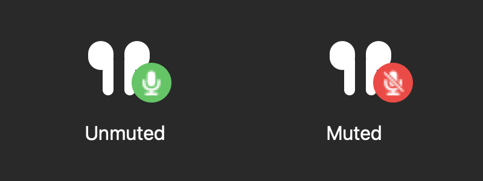

<div align="center">
  
  <h1>Air Mute</h1>
  <p><strong>Microphone control, right from your AirPods.</strong></p>
  <p>Squeeze an AirPod stem to mute or unmute your microphone.<br />A small macOS menu bar app keeps the status in view.</p>
  <p>
    <a href="https://github.com/fhajjej-ship-it/air-mute/releases/download/v1.0.2/Air-Mute-1.0.2-macOS-arm64.zip"><strong>Download for Mac ↓</strong></a>
    &nbsp; · &nbsp;
    <a href="https://github.com/fhajjej-ship-it/air-mute/releases/tag/v1.0.2">Release notes</a>
  </p>
  <p>Apple Silicon · macOS 14+ · Free &amp; open source</p>
</div>

---

## Small app. Clear feedback.

Keep your hands on your work. Air Mute listens for the AirPods mute gesture and changes your microphone's device mute state. A white earbud icon and a colored badge show where you stand.

<div align="center">
  
  <p><sub>Actual menu bar artwork, enlarged for clarity.</sub></p>
</div>

| Stem control | Visible status | Local audio handling |
| --- | --- | --- |
| Mute and unmute with a squeeze. | Green means unmuted. Red means muted. | Audio buffers are discarded locally; no recordings are saved or sent. |

## Get started

1. [Download Air Mute 1.0.2](https://github.com/fhajjej-ship-it/air-mute/releases/download/v1.0.2/Air-Mute-1.0.2-macOS-arm64.zip), extract the ZIP, and move **Air Mute.app** to **Applications**.
2. Quit any other microphone-mute utility, then open Air Mute. Allow microphone and Bluetooth access when macOS asks.
3. Connect your AirPods and select them as your Mac's microphone.
4. Squeeze the stem to mute. Squeeze again to unmute. Watch the Air Mute badge for device status.

Normal macOS first-open and privacy prompts may appear. The release includes a [download checksum](https://github.com/fhajjej-ship-it/air-mute/releases/tag/v1.0.2).

## What to expect

- **Device mute:** Air Mute controls the default input device's CoreAudio mute property. A call app's mute button, including Codex's, may show a different state.
- **Menu controls:** Open the menu to view status, toggle mute, refresh the connection status, or quit.
- **Manual startup:** Open Air Mute when you need it. It doesn't install a login item or background daemon.
- **When quitting:** The current version attempts to unmute the microphone. Check your call's mute state before quitting if you need to remain muted.

## Privacy

Air Mute keeps an input-only microphone connection active to receive AirPods gestures. It discards audio buffers without inspecting samples, saving, transcribing, transmitting, or playing them through speakers. macOS's microphone activity indicator remains active while it runs.

The app contains no network code. Bluetooth access supplies connection status. Diagnostic output can contain device names and Bluetooth addresses, so keep logs private. Quit stops the input connection and gesture handlers; a crash or force-quit may bypass cleanup.

## Compatibility

**Requires an Apple Silicon Mac running macOS 14 or later.** Physical mute/unmute has been verified with **AirPods Pro 3 on macOS 27.0.1**, including during Codex voice. The current version was installed and its AirPods input connection verified on October 8, 2026.

Older macOS versions, Intel builds, AirPods Max, other AirPods models, device swaps during an active connection, and crash recovery have not been verified. Support for these combinations is not promised.

<details>
<summary><strong>Build from source</strong></summary>

Requires macOS, Apple's Command Line Tools (Swift and the macOS SDK), and Python 3. No additional package dependencies are used.

```sh
git clone https://github.com/fhajjej-ship-it/air-mute.git
cd air-mute
sh build.sh
```

The result is `build/Air Mute.app`, built for the host architecture and ad-hoc signed locally. The script does not install or launch it and refuses to overwrite an existing output app. Supply a fresh output directory for another build.

Bundle identifier: `com.fhajjejshipit.airmute`. Version **1.0.2**, build **7**.

</details>

## License

[MIT](LICENSE). Air Mute is based on PodsMute; license and source provenance are preserved in [UPSTREAM.md](UPSTREAM.md) and `upstream/README.md`. The app's original artwork and changes are also included under MIT. No exclusive authorship of inherited code is claimed.

This project is independent of similarly named applications and is not affiliated with Apple.
